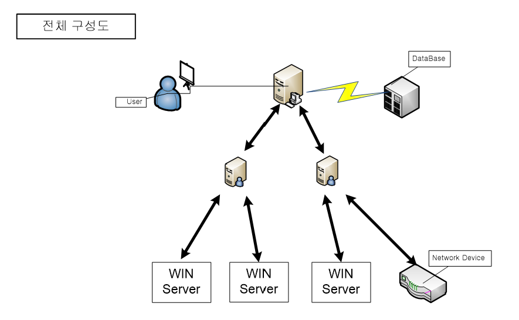
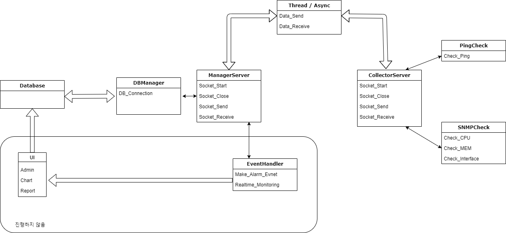
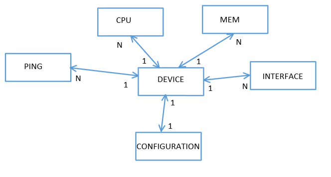
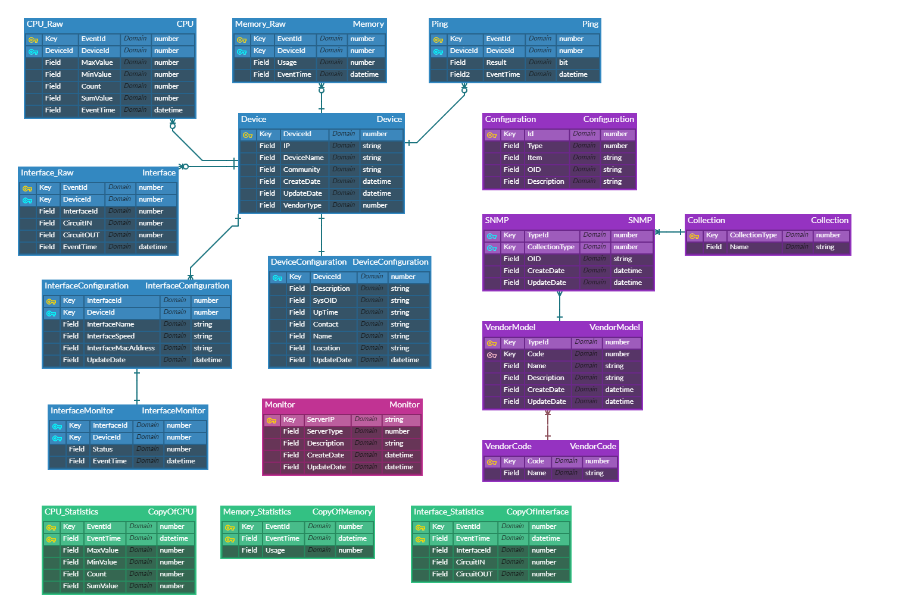

# NMS
> Specification

- ADO DB Programming with MSSql 
- TCP Network Socket Programming in WinSock 
- C++ Language usage
- Console Programming

## Gain points
```
1. DB 연결 부터 Query Execute 까지 Rappter Class를 구현하고 API를 제공한다
2. Server Socket과 Clinet Socket을 구현하고 통신부와 비즈니스 처리를 구분한다
3. MSSql 을 이용한 DB 프로그래밍에 익숙해진다
4. 데이터 수집 기능이 완료되면 나중에 웹 UI를 통해 모니터링 솔루션을 만들 수 있다
```

## INSTALL
```
* Server DLL
1. ADO 
- #import "C:\program files\common files\system\ado\msado21.tlb" no_namespace rename("EOF", "EndOfFile")
2. SNMP
3. ICMP
```

## Structures
```text
ManagerServer/
├─ Ado/
│  └─ AdoCommand
│  └─ AdoField
│  └─ AdoRecordSet  
├─ Config/
├─ Util/            
├─ models/
```

## Configuration

File Loader 구현은 필요시에 진행한다

- `config` variables
  | Name                | default | required | description             |
  | ------------------- | ------- | -------- | ----------------------- |
  | UserName            |         | yes      |                         |
  | UserPassword        |         | yes      |                         |
  | DBIpAddress         |         | yes      |                         |
  | DBName              |         | yes      |                         |
  | DBPort              |         | yes      |                         |
  | DBProvider          |         | yes      |                         |
  | DBConnectionTimeout |         | no       |                         |
  | DBCommandTimeout    |         | no       |                         |

# Running the project
Visual Studio 2019 Version으로 개발되었다 

Manager Server가 정상적으로 구동되면 DB 연결이 완료되고 Socket Listen Start

Collect Server가 정상적으로 구동되면 Server Socket이 연결되고 SNMP, ICMP 데이터 수집을 시작한다

# System design

<br/>
<br/>

# Database design
Database schema is written by AqueryTool (https://www.erdcloud.com/)

<br/>
<br/>

# 프로젝트 설게서 
[문서]](./Doc/Project.md)

# 기능 정의서
[문서]](./Doc/Definition.md)

## Visual Studio Version
2019 profesional